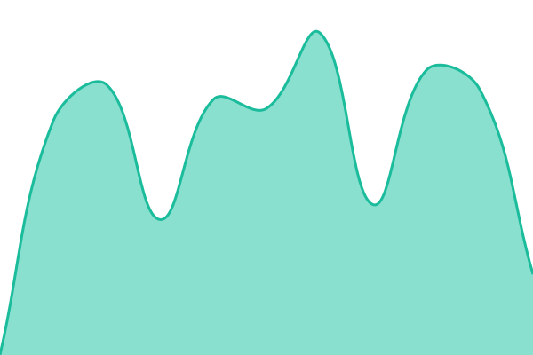
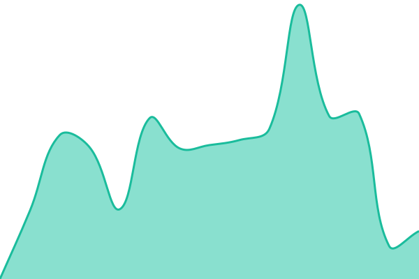
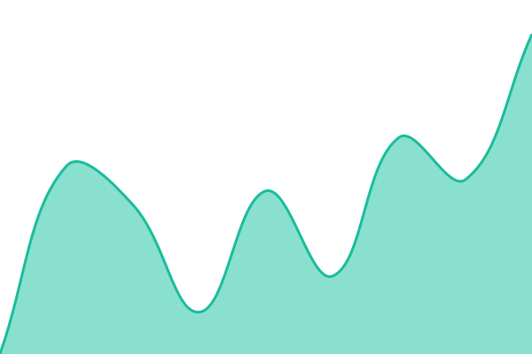

# [📈 Live Status](https://oatnog.github.io/UHH-PacIOOS-monitoring): <!--live status--> **🟥 Complete outage**

This repository contains the open-source uptime monitor and status page for [Allan A](https://goosemoon.org), powered by [Upptime](https://github.com/upptime/upptime).

With [Upptime](https://upptime.js.org), you can get your own unlimited and free uptime monitor and status page, powered entirely by a GitHub repository. We use [Issues](https://github.com/oatnog/UHH-PacIOOS-monitoring/issues) as incident reports, [Actions](https://github.com/oatnog/UHH-PacIOOS-monitoring/actions) as uptime monitors, and [Pages](https://oatnog.github.io/UHH-PacIOOS-monitoring) for the status page.

<!--start: status pages-->
<!-- This summary is generated by Upptime (https://github.com/upptime/upptime) -->
<!-- Do not edit this manually, your changes will be overwritten -->
<!-- prettier-ignore -->
| URL | Status | History | Response Time | Uptime |
| --- | ------ | ------- | ------------- | ------ |
|  [hppk SORT](http://sunrise.soest.hawaii.edu/data/hppk/latest_hppk.SORT_ant.gif) | 🟥 Down | [hppk-sort.yml](https://github.com/oatnog/UHH-PacIOOS-monitoring/commits/HEAD/history/hppk-sort.yml) | 

 1268ms
     
 | 

<a href="https://oatnog.github.io/UHH-PacIOOS-monitoring/history/hppk-sort">23.07%</a>
    

|  [hppk RAD](http://sunrise.soest.hawaii.edu/data/hppk/latest_hppk.RAD_DirF_anim.gif) | 🟥 Down | [hppk-rad.yml](https://github.com/oatnog/UHH-PacIOOS-monitoring/commits/HEAD/history/hppk-rad.yml) | 

 847ms
     
 | 

<a href="https://oatnog.github.io/UHH-PacIOOS-monitoring/history/hppk-rad">23.31%</a>
    

|  [hkkh SORT](http://sunrise.soest.hawaii.edu/data/hkkh/latest_hkkh.SORT_ant.gif) | 🟥 Down | [hkkh-sort.yml](https://github.com/oatnog/UHH-PacIOOS-monitoring/commits/HEAD/history/hkkh-sort.yml) | 

 1232ms
     
 | 

<a href="https://oatnog.github.io/UHH-PacIOOS-monitoring/history/hkkh-sort">31.00%</a>
    

|  [hkkh RAD](http://sunrise.soest.hawaii.edu/data/hkkh/latest_hkkh.RAD_Beam_anim.gif) | 🟥 Down | [hkkh-rad.yml](https://github.com/oatnog/UHH-PacIOOS-monitoring/commits/HEAD/history/hkkh-rad.yml) | 

 696ms
     
 | 

<a href="https://oatnog.github.io/UHH-PacIOOS-monitoring/history/hkkh-rad">31.33%</a>
    

<!--end: status pages-->

[**Visit our status website →**](https://oatnog.github.io/UHH-PacIOOS-monitoring)

## 📄 License

- Powered by: [Upptime](https://github.com/upptime/upptime)
- Code: [MIT](./LICENSE) © [Anand Chowdhary](https://anandchowdhary.com), supported by [Pabio](https://pabio.com)
- Data in the `./history` directory: [Open Database License](https://opendatacommons.org/licenses/odbl/1-0/)
